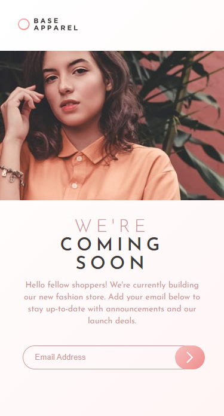

# Base Apparel Coming Soon Challenge

Welcome to my submission for the Base Apparel Coming Soon challenge on Frontend Mentor! This project is a landing page that displays a "coming soon" message and a sign-up form for a clothing brand called Base Apparel. The landing page is fully responsive and uses ReactJS to provide an interactive user experience.

## Table of Contents
- [Features](#features)
- [Technologies Used](#technologies-used)
- [Screenshots](#screenshots)
- [Live Demo](#live-demo)
- [Getting Started](#getting-started)
- [Customization](#customization)
- [Deployment](#deployment)
- [Credits](#credits)

## Features
- Responsive design that works on desktops, tablets, and mobile devices
- Sign-up form that collects and validates the user's email address

## Technologies Used
- ReactJS
- HTML
- CSS
- JavaScript

## Screenshots
|  |  |
| ------------------------------ | ----------------------------- |
| Desktop version                | Mobile version                |

## Live Demo

You can view a live demo of the project at https://hatemhenchir.github.io/base-apparel-coming-soon/.

## Getting Started
1. Clone or download the repository
2. Navigate to the project directory in your terminal
3. Run `npm install` to install the necessary dependencies
4. Run `npm start` to start the development server
5. The component will be available at http://localhost:3000

## Customization
If you'd like to customize the landing page, here are some files you might want to modify:

- public/index.html: Update the title of the page to reflect your brand
- src/assets/images/: Replace the images with your own brand's images
- src/components/Header.jsx: Update the logo and links in the header
- src/components/Hero.jsx: Update the hero section with your own content
- src/components/Input.jsx: Update the form labels and error messages
- src/components/ComingSoon.jsx: Update the message in the "coming soon" section

## Deployment
To deploy the component to a live environment, run `npm run build` and use the files in the `build` directory.

## Credits
Design inspiration and assets provided by [Frontend Mentor](https://www.frontendmentor.io/)
- My LinkedIn: [@hatem-henchir-7a92141a8](https://www.linkedin.com/in/hatem-henchir-7a92141a8/)
- My Frontend Mentor: [@hatemhenchir](https://www.frontendmentor.io/profile/hatemhenchir)